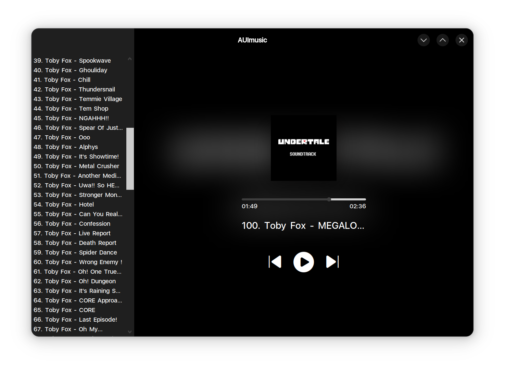

# Full-fledged AUI App Template

> [!NOTE]
> Click the <kbd>Use this template</kbd> button to setup your own AUI app project!

It is a template repository that provides a pure template to make it easier to create a new AUI-based application
project.



The main goal of this template is to speed up the setup phase of application development for both new and experienced
developers by preconfiguring the project scaffold and CI set up on GitHub.

This template project features:
- Building, testing, code quality checking and releasing with [GitHub Actions](gh:actions)
- Application auto updating (Windows only)
- AUI assets
- Tests

# Getting Started

It is worth mentioning the benefits of using GitHub Templates. By created a new project using a template, you will start
with no history or reference to this repository.

## Continuous Integration

In this project, continuous integration relies on [GitHub Actions](gh:actions), a set of workflows that enable
automation of building, testing and releasing process.

In the `.github/workflows` directory, you can find definitions for the following GitHub Actions workflows:
- [Build](.github/workflows/build.yml)
  - Triggered on `push` and `pull_request` events.
  - Caches AUI.Boot (`~/.aui`).
    - AUI.Boot will pull precompiled AUI binaries in most cases.
    - Subsequent builds are faster thanks to `cache` job, no matter whether AUI Boot pulled precompiled binaries.
  - Builds the project for the supported platforms.
  - Runs Tests.
  - Generates installable packages.
  - Prepares a draft release of the GitHub Releases page for manual review.
- [Code Quality](.github/workflows/code-quality.yml)
  - Triggered on `pull_request` events.
  - Performs `clang-tidy` checks (static analysis) and generates nice summary with `.github/tidy-summary.py`.
  - Performs `valgrind` checks on tests (dynamic analysis).

  See [Memleak Demo PR](https://github.com/aui-framework/example_app/pull/3).


## Code Quality and Formatting

The template includes `.clang-format` and `.clang-tidy`, the latter is used for code quality checks.

## Release Process

To create a release, simply push an update to version in `CMakeLists.txt`. Pipeline will create a GitHub Release Draft
for you. After release draft is created, perform manual review and submit release.

# Syncing with this template

In some cases, you might want to sync with this template. Generally, you would want to sync with CI/CD stuff
(`.github`). If such, use some git techniques:

```shell
# only for the first time
git remote add template https://github.com/aui-framework/example_app

# syncing
git fetch template
git merge template/master --allow-unrelated-histories 

# from now on, check git status and throw out anything you don't need

# remove unwanted files, i.e., SumTest.cpp:
git rm tests/SumTest.cpp -f

# keep YOURS src, tests, CMakeLists:
git checkout HEAD -- CMakeLists.txt src tests
```

# IDE setup

## CLion

Works out of the box.

## VS Code

1. Install extensions recommended by workspace. You can see them in `.vscode/extensions.json`.
2. Check and adjust `.vscode/settings.json` if needed.
3. Hit `F1` & type `CMake: Build`. If it asks for a toolchain, choose "Unspecified".
4. After build is complete, in the left bar, choose CMake logo. In the tree view, right click on "example_app", choose
   "Set as Build Target", and also "Set as Debug Target".
5. `F1` & `CMake: Debug`.